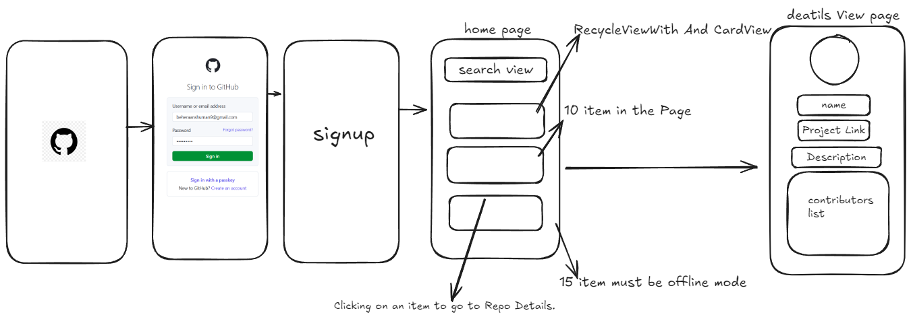
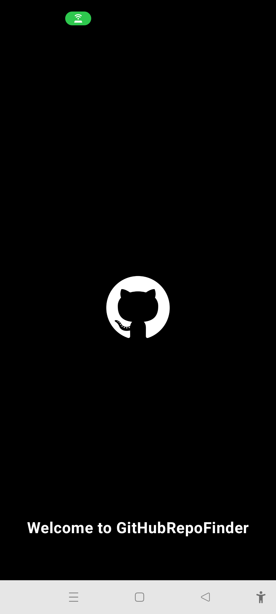
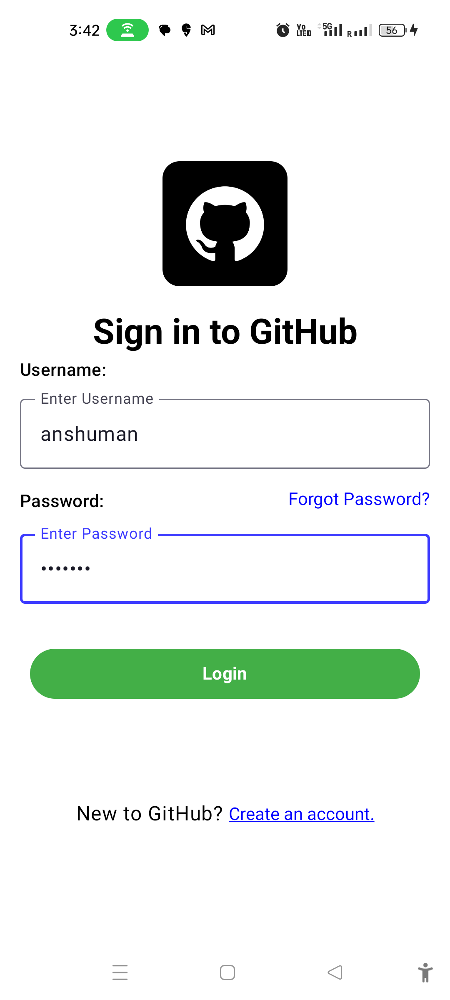
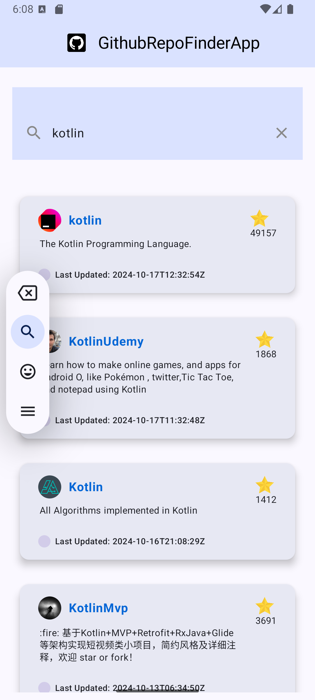
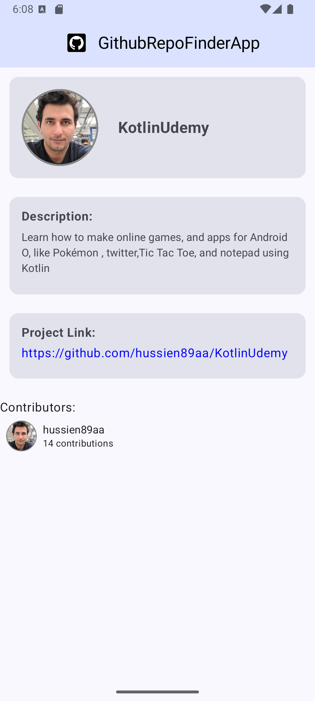

# GitHub Repository Search App


Build a mobile application using the GitHub API to search through repositories. Select a repository and view detailed information about the project and contributors. Upon selecting a contributor, list the repositories tagged to that contributor.

The application consists of two screens:

- **Home Screen** - Search and display the list of repositories.
- **Repo Details Screen** - Displays the necessary information about the selected repository.

## Features

### Home Screen
- A search bar to query GitHub repositories using the GitHub API.
- A RecyclerView using CardView to display the search results.
- Results are paginated with a limit of 10 items per page.
- Clicking on an item navigates to the Repo Details screen.

### Repo Details Screen
- Detailed description of the selected repository.
- Information such as:
    - Repository image (owner's avatar).
    - Repository name.
    - Project link (clickable to open in a web view).
    - Description.
    - Contributors list (displayed in a scrollable view).
- Clicking on the Project Link opens a web view showing the project's content.

## Implementation Details



### Technologies and Architecture
- **MVVM Architecture**: Used to separate UI logic from the data-handling logic.
- **Jetpack Libraries**: LiveData, ViewModel, Navigation Component.
- **Retrofit**: For network requests to the GitHub API.
- **Room**: Used for offline data storage.
- **Coroutines**: For asynchronous programming and handling background tasks.

### Key Features
1. **Coroutines or RxJava**: Used to handle asynchronous operations such as network requests.
2. **Room Database**: The homepage saves the first 15 items' data offline so that users can view the saved data even if the network is not available.
3. **Pagination**: Implemented on the home page to fetch 10 items at a time from the GitHub API.

## Apk File Link 
[Dowload The APK File here ](https://drive.google.com/file/d/1DeIUmzEHPaXoCCNO2tx0sGz8VzXYMFLe/view?usp=drive_link)
---
## Video Link 
[video](https://drive.google.com/file/d/1O0LACnYr7or7FIPv1aegSkHAWVNoztmW/view?usp=sharing)
---
## Screenshots
#### 1.Splash Screen 



### 2. Login and signup Screen



### 1. Home Screen
- Search for repositories.
- Display results in a paginated list.
- Click on a repository to view detailed information.


### 2. Repo Details Screen
- View detailed repository information.
- Clickable project link.
- Scrollable list of contributors.



## Setup Instructions

1. **Clone the repository:**
   ```bash
   git clone https://github.com/yourusername/repo-search-app.git
   ```
2**Open the project in Android Studio.**

3**Sync Gradle files and build the project.**

4**Obtain a GitHub API token and add it to the project:**
  - In your `ApiClient` class, replace the placeholder with your GitHub API token.

5**Run the project on an emulator or device.**